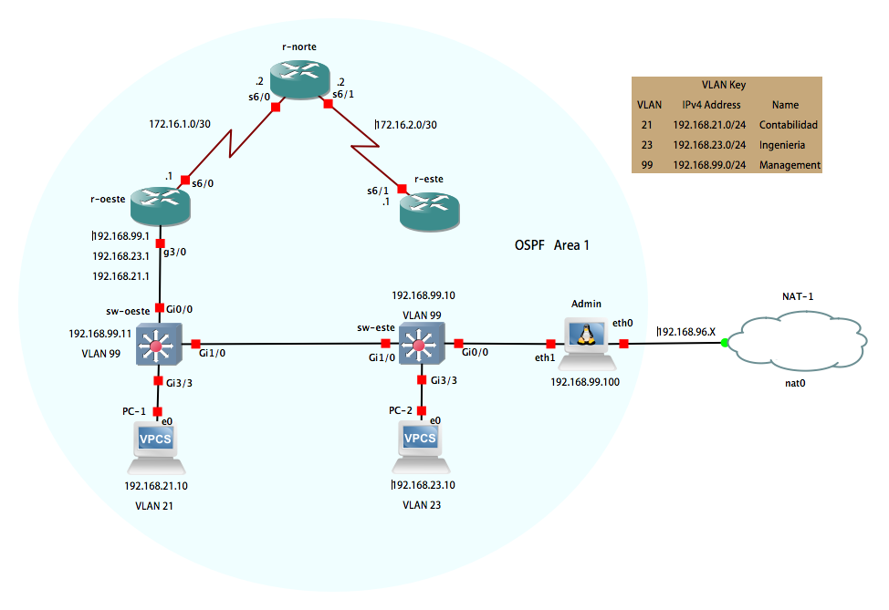

# CCNA: Routing and Switching Essentials

## Skills Assessment - Student Training  

En esta practica vamos a realizar la configuracion de una red simple para
que que pueda tener conexion con IPv4, switch security, inter VLAN routing,
OSPF and DHCP.  
Los pasos serian los siguientes:

- Part 1: Initialize Devices  
- Part 2: Configure Device Basic Settings  
- Part 3: Configure Switch Security, VLANs, and Inter-VLAN Routing   
- Part 4: Configure OSPF  
- Part 5: Implement DHCP on R1 for VLAN 21 and VLan 23  

Para la realizacion de la practica hemos usado la herramienta GNS3 y los
dispositivos usados son los siguientes:
- Router: Cisco C7200 (c7200-adventerprisek9-mz.152-4.M7.image)
- Switch: CiscoIOSvL2 (vios_l2-adventerprisek9-m.vmdk.SSA.152-4.0.55.E)
- NetworkAutomation GNS3 (Sistema operativo Ubuntu + extras (Ansible, Paramiko...)

Dado que son imagenes simuladas de sistemas operativos de *CISCO*, pueden 
fallar/faltar algunos comandos, pero salvo error en la descarga esta todo lo necesario.

Para poder realizar toda la orquestacion/automatizacion mediante **ANSIBLE**, debemos
tener una configuracion inicial en los dispositivos *CISCO* descritos anteriormente o 
introducir manualmente la configuracion inicial segun la necesidad o los requirimientos 
de la practica.

La configuracion inicial necesaria para cada dispositivo esta en la carpeta 
"Initial Setup"

# Steps to follow in order to make a good configuration:

## 1-º Configure the Network Automation:

### Configure the interfaces:

- auto eth0  
- iface eth0 inet dhcp  
- auto eth1  
- iface eth1 inet static  
- address 192.168.99.100  
- netmask 255.255.255.0  
- gateway 192.168.99.1  
  
### Configure */etc/hosts*:

- 192.168.99.10 sw-este  
- 192.168.99.11 sw-oeste  
- 192.168.99.1 r-oeste  
- 172.16.1.2 r-norte  
- 172.16.2.1 r-este  

### We have to give root permission to ssh:  
- chown root /root/.ssh/config  

### To can reach Internet and the local lan we have to define a static route and delete another one:  
- route add -net 172.16.0.0/16 dev eth1  
- route del -net 0.0.0.0/0 gw 192.168.99.1  

## 2-º Configure Ansible  

We have to create this two files in order not to overwrite the original files.

root@Admin:~# cat **hosts** 

[switch]  
sw-este  
sw-oeste  
[router]  
r-oeste  
r-norte  
r-este  

root@Admin:~# cat **ansible.cfg**   

[defaults]  
inventory = hosts  
become_method = enable  
host_key_checking = false  
gather_facts = false  
timeout = 100  
remote_user = ansible  

## 3-º Apply the basic configuration for SW-ESTE, which you will find it in “Initial setup” folder.  

## 4-º With the next commands we are going to execute the playbook for the SW-ESTE role.  

- ansible-playbook -i  hosts roles/config_sw_este/tasks/create_vlan.yml –k –u ansible  
- ansible-playbook -i  hosts roles/config_sw_este/tasks/config_vlan.yml –k –u ansible  

With this two simple commands we have configured the sw-este, now we are going to configure sw-oeste.  

## 5-º Apply the basic configuration for SW-OESTE, which you will find it in “Initial setup” folder.  

##  6-º With the next commands we are going to execute the playbook for the SW-OESTE role.  

- ansible-playbook -i  hosts roles/config_sw_oeste/tasks/create_vlan.yml –k –u ansible  
- ansible-playbook -i  hosts roles/config_sw_oeste/tasks/config_vlan.yml –k –u ansible  

Once we have finished the configuration for sw-oeste, we will continue with r-oeste.  

## 7-º Apply the basic configuration for R-OESTE, which you will find it in “Initial setup” folder.  

After we apply the basic configuration, we have to type manually “write memory” on the route in order to will be able to save automatically the configuration after.  

## 8-º With the next commands we are going to execute the playbook for the R-OESTE role.  

- ansible-playbook -i  hosts roles/config_r_oeste/tasks/config_interfaces.yml –k –u ansible  
- ansible-playbook -i  hosts roles/config_r_oeste/tasks/config_subinterfaces.yml –k –u ansible
- ansible-playbook -i  hosts roles/config_r_oeste/tasks/config_ospf.yml –k –u ansible  

We are going to do steps 7 and 8 for all the routers that we have in our network minus the role “config_subinterfaces.yml because in router NORTE and ESTE we don’t have VLAN.  

## 9-º Apply the basic configuration for R-NORTE, which you will find it in “Initial setup” folder.  

After we apply the basic configuration, we have to type manually “write memory” on the route in order to will be able to save automatically the configuration after.  

## 10-º With the next commands we are going to execute the playbook for the R-NORTE role.  

- ansible-playbook -i  hosts roles/config_r_norte/tasks/config_interfaces.yml –k –u ansible  
- ansible-playbook -i  hosts roles/config_r_norte/tasks/config_ospf.yml –k –u ansible  

## 11-º Apply the basic configuration for R-ESTE, which you will find it in “Initial setup” folder.  

After we apply the basic configuration, we have to type manually “write memory” on the route in order to will be able to save automatically the configuration after.  
With the basic configuration, we have enough for R-ESTE so far.

## 12-   Enable DHCP on R1  
The next step in the is to enable DHCP on R1. I am going to create a new task config_dhcp.yml which you can find in roles/config_r_oeste/tasks.  

To execute the role you can use the following command:  

- ansible-playbook -i hosts roles/confi_r_oeste/tasks/config_dhcp.yml -k -u ansible  
 
